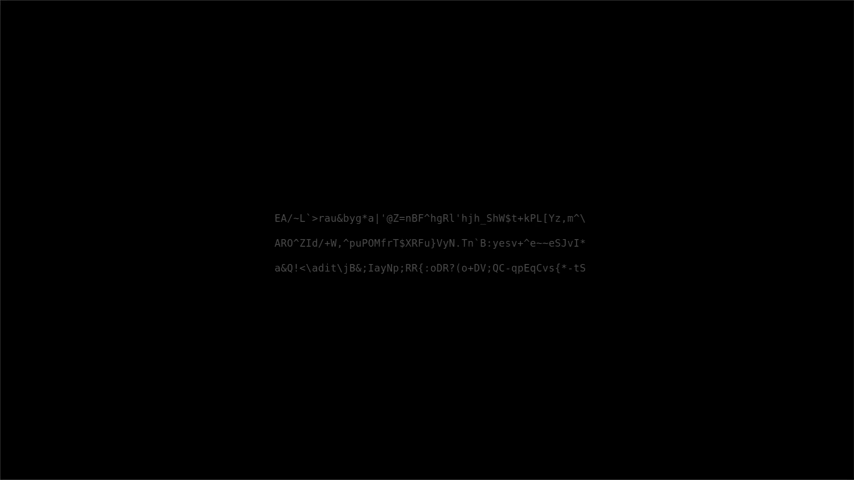

# ttypr

**t**erminal **ty**ping **pr**actice

Current typing options: **ASCII** and **Words**

Based on [Ratatui][Repo]

# Installation

```shell
cargo install ttypr
```

# Usage

**Menu mode:**

- **q** - exit the application
- **i** - switch to typing mode
- **m** - switch typing option (ASCII, Words)

**Typing mode:**

- **ESC** - switch to menu mode

# Credits

- [filipriec][FilipsGitLab] - creating a vector of styled Spans idea, if needs_redraw rendering concept

- Concept taken from: [Monkeytype][MonkeytypeLink]

[Repo]: https://github.com/ratatui/ratatui
[FilipsGitLab]: https://gitlab.com/filipriec
[MonkeytypeLink]: https://monkeytype.com
