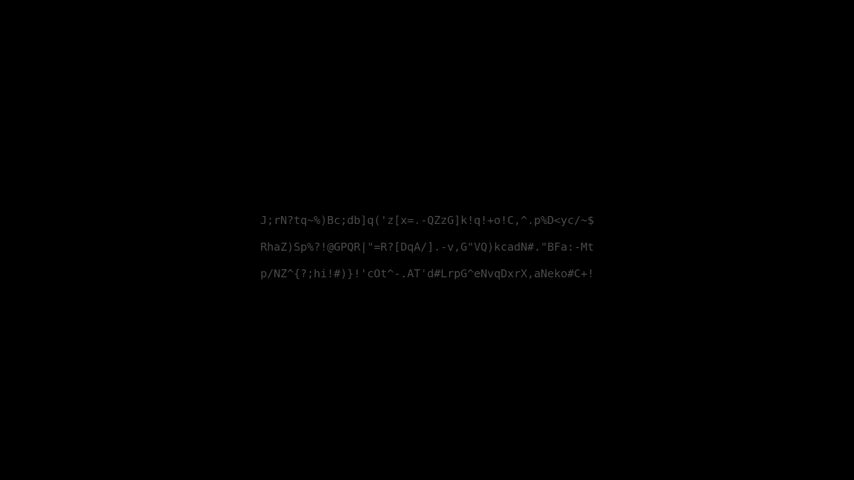

# ttypr

**t**erminal **ty**ping **pr**actice

Current typing options: **ASCII**, **Words** and **Text**

Based on [Ratatui][RatatuiRepo]

# Installation

```shell
cargo install ttypr
```

# Usage

> **Notes:**
>
> - The application starts in the **Menu mode**.
>
> - For larger font - increase the terminal font size.

**Menu mode:**

- **h** - display the help page
- **q** - exit the application
- **i** - switch to Typing mode
- **o** - switch Typing option (ASCII, Words, Text)
- **n** - toggle notifications
- **c** - toggle counting mistyped characters
- **w** - display top mistyped characters
- **r** - clear mistyped characters count

**Typing mode:**

- **ESC** - switch to Menu mode
- **Character keys** - Type the corresponding characters
- **Backspace** - Remove characters

# Acknowledgements

- [filipriec][FilipsGitLab] - creating a vector of styled Spans idea, if needs_redraw rendering concept

- Concept taken from: [Monkeytype][MonkeytypeLink]

# License

This project is licensed under the [MIT License][MITLicense].

[RatatuiRepo]: https://github.com/ratatui/ratatui
[FilipsGitLab]: https://gitlab.com/filipriec
[MonkeytypeLink]: https://monkeytype.com
[MITLicense]: https://github.com/hotellogical05/ttypr/blob/main/LICENSE
